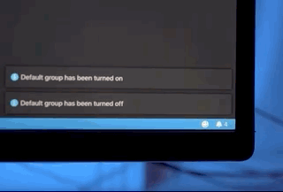
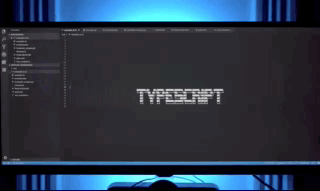

Visual Studio Code Extension – Hue
===
Hue is a Visual Code extension that integrates your favorite Hue lights with your favorite code editor!

Controlling your Hue lights is just one keyboard shortcut away. And switching context between files are now made easy by making your Hue lights adapt to your file type and preference. See how to set it up in the [settings](#settings).

See it in action
---




[Download](https://marketplace.visualstudio.com/items?itemName=kelvienhidayat.vscode-hue) and give it a try

Prerequisites
---
- Connect your Hue Bridge to the same network as your computer by LAN cable

How to use?
---
1. Register your Hue Bridge:
`Ctrl+Shift+p` or on Mac `Cmd+Shift+p` then type `Hue: Register bridge`, pick a Hue Bridge that you want to register
2. See list of supported commands below:

|Command|Command Palette|Hue Action|Keyboard shorcuts|Mac keyboard shortcuts
|:-|:-|:-|:-|:-|
|extension.hue.registerBridge|Hue: Register bridge|Attempt to discover and register a Hue bridge|||
|extension.hue.registerLights|Hue: Register new lights|Attempt to discover and register new Hue lights|||
|extension.hue.setDefaultGroup|Hue: Set default group|Set default group (If not set, it will be defaulted to all lights|||
|extension.hue.turnDefaultGroupOn|Hue: Turn default group on |Turn default group on|<kbd>Ctrl+h 1</kbd>|<kbd>Cmd+h 1</kbd>|
|extension.hue.turnDefaultGroupOff|Hue: Turn default group off |Turn default group off|<kbd>Ctrl+h 0</kbd>|<kbd>Cmd+h 0</kbd>|
|extension.hue.enableAmbientLights|Hue: Enable ambient lights|Enable lights' color to be adaptive to the current file's language you are on|||
|extension.hue.disableAmbientLights|Hue: Disable ambient lights|Disable lights' color to be adaptive to the current file's language you are on|||

[Settings](#settings)
---
Settings can be used to override the Hue Bridge IP address, and the ambient lighting rules, etc.

|Key|Type|Default value|Description|
|:-|:-|:-|:-|
|hue.bridge|object|{}|Bridge configuration. `{id, ipAddress, username}`|
|hue.defaultGroup|string|null|Default group name (Defaulted to all lights if group is empty)|
|hue.ambientLights.enabled|bool|false|Ambient lights status|
|hue.ambientLights.rules|object|{}|Ambient lights rules. Rules consists of an object with [language identifier](https://code.visualstudio.com/docs/languages/identifiers#_known-language-identifiers) as the key associated with a light states/group states/or a state for your default group.`{language identifier: {lightStates: {[lightName]: state}|groupState: {[groupName]: state}|state}}`.|

Example of `settings.json`:
```jsonc
{
  "hue.bridge": {
    "id": "ABC",
    "ipAddress": "192.168.1.123",
    "username": "XYZ",
  },
  "hue.defaultGroup": "Mission Control Center",
  "hue.ambientLights.enabled": true,
  "hue.ambientLights.rules": {
    "clojure": { // language identifier
      "lightStates": { // Multiple lights
        "Hue play 1": { // Light name
          "on": true,
          "bri": 254,
          "hue": 43000,
          "sat": 228,
          "xy": [
            0.1793,
            0.193
          ],
          "ct": 153
        },
        "Hue play 2": { // Light name
          "on": true,
          "bri": 254,
          "hue": 31757,
          "sat": 213,
          "xy": [
            0.1999,
            0.4912
          ],
          "ct": 153
        }
      }
    },
    "python": { // language identifier
      "groupStates": { // Multiple groups
        "Monitors": { // Group name
          "on": true,
          "bri": 254,
          "hue": 43048,
          "sat": 254,
          "xy": [
            0.1564,
            0.1706
          ],
          "ct": 153
        },
        "Bedroom Desktop": { // Group name
          "scene": "ABC123"
        }
      }
    },
    "sql": { // language identifier
      "state": { // Will use default group if configured in settings. Otherwise it will default to all lights
        "bri": 254,
        "hue": 42798,
        "sat": 84,
        "xy": [
          0.3064,
          0.3111
        ],
        "ct": 153
      }
    }
  }
}
```

### State
Refer to official site for [lights' state](https://developers.meethue.com/develop/hue-api/lights-api/#set-light-state) and [groups' state](https://developers.meethue.com/develop/hue-api/groupds-api/#set-gr-state) for more details

|state|type|description|
|:-|:-|:-|
|on|bool|On/Off state of the light. On=true, Off=false|
|bri|uint8|The brightness value to set the light to. Brightness is a scale from 1 (the minimum the light is capable of) to 254 (the maximum). Note: a brightness of 1 is not off|
|hue|uint16|The hue value to set light to. The hue value is a wrapping value between 0 and 65535. Both 0 and 65535 are red, 25500 is green and 46920 is blue.|
|sat|uint8|Saturation of the light. 254 is the most saturated (colored) and 0 is the least saturated (white).	|
|xy|list 2..2 of float 4|The x and y coordinates of a color in CIE color space. The first entry is the x coordinate and the second entry is the y coordinate. Both x and y must be between 0 and 1. If the specified coordinates are not in the CIE color space, the closest color to the coordinates will be chosen.|
|ct|uint16|The Mired color temperature of the light. 2012 connected lights are capable of 153 (6500K) to 500 (2000K).	|
|alert|string|The alert effect,is a temporary change to the bulb’s state, and has one of the following values: “none” – The light is not performing an alert effect. “select” – The light is performing one breathe cycle. “lselect” – The light is performing breathe cycles for 15 seconds or until an "alert": "none" command is received|
|effect|string|The dynamic effect of the light. Currently “none” and “colorloop” are supported. Other values will generate an error of type 7.Setting the effect to colorloop will cycle through all hues using the current brightness and saturation settings.	|
|transitiontime|uint16|The duration of the transition from the light’s current state to the new state. This is given as a multiple of 100ms and defaults to 4 (400ms). For example, setting transitiontime:10 will make the transition last 1 second.	|
|bri_inc|-254 to 254|Increments or decrements the value of the brightness.  bri_inc is ignored if the bri attribute is provided. Any ongoing bri transition is stopped. Setting a value of 0 also stops any ongoing transition. The bridge will return the bri value after the increment is performed.	|
|sat_inc|-254 to 254|Increments or decrements the value of the sat.  sat_inc is ignored if the sat attribute is provided. Any ongoing sat transition is stopped. Setting a value of 0 also stops any ongoing transition. The bridge will return the sat value after the increment is performed.|
|hue_inc|-65534 to 65534|Increments or decrements the value of the hue.   hue_inc is ignored if the hue attribute is provided. Any ongoing color transition is stopped. Setting a value of 0 also stops any ongoing transition. The bridge will return the hue value after the increment is performed.Note if the resulting values are < 0 or > 65535 the result is wrapped.|
|ct_inc|-65534 to 65534|Increments or decrements the value of the ct. ct_inc is ignored if the ct attribute is provided. Any ongoing color transition is stopped. Setting a value of 0 also stops any ongoing transition. The bridge will return the ct value after the increment is performed.	|
|xy_inc|list 2..2 of float 4|Increments or decrements the value of the xy.  xy_inc is ignored if the xy attribute is provided. Any ongoing color transition is stopped. Setting a value of 0 also stops any ongoing transition. Will stop at it’s gamut boundaries. The bridge will return the xy value after the increment is performed. Max value [0.5, 0.5].	|
|scene|string|The scene identifier if the scene you wish to recall. (This can be used to set lights within a group to be in a variety of states)|

Dev note
---
There are still a lot more rooms to be covered in this extension, and please feel free to contribute!